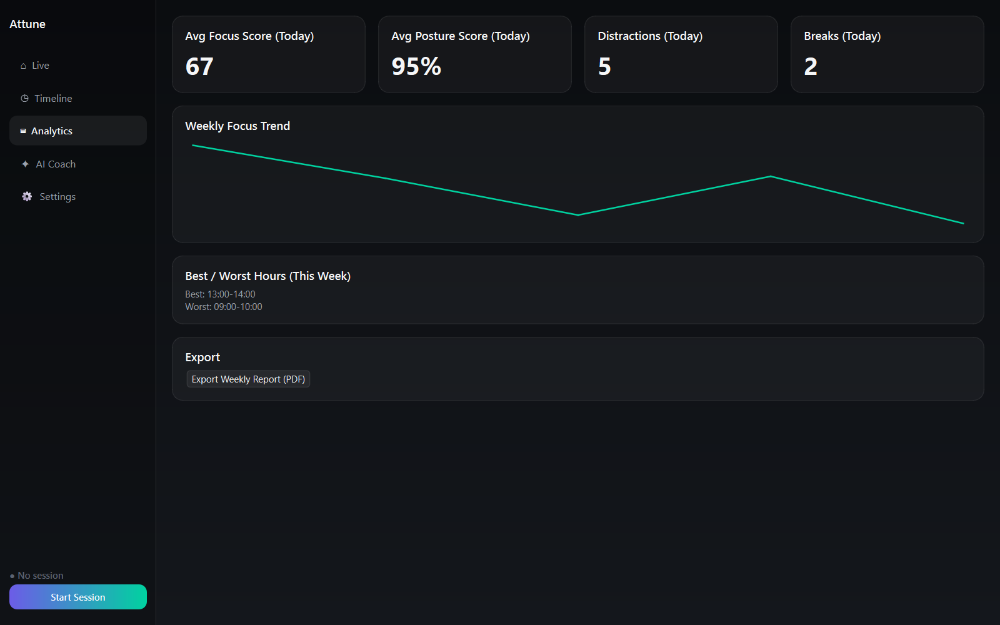
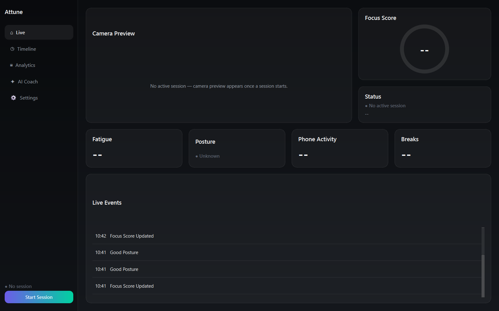
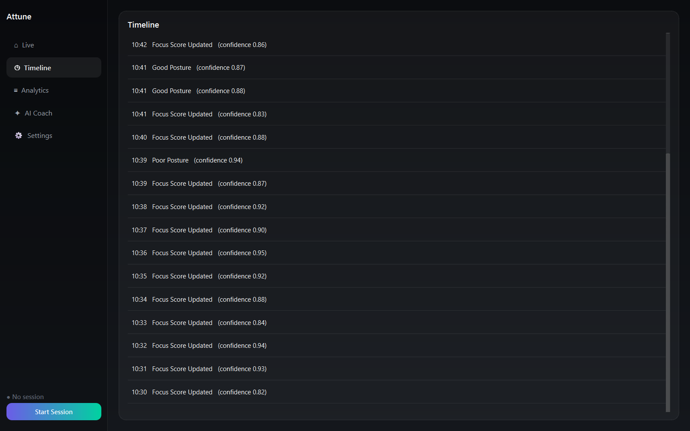
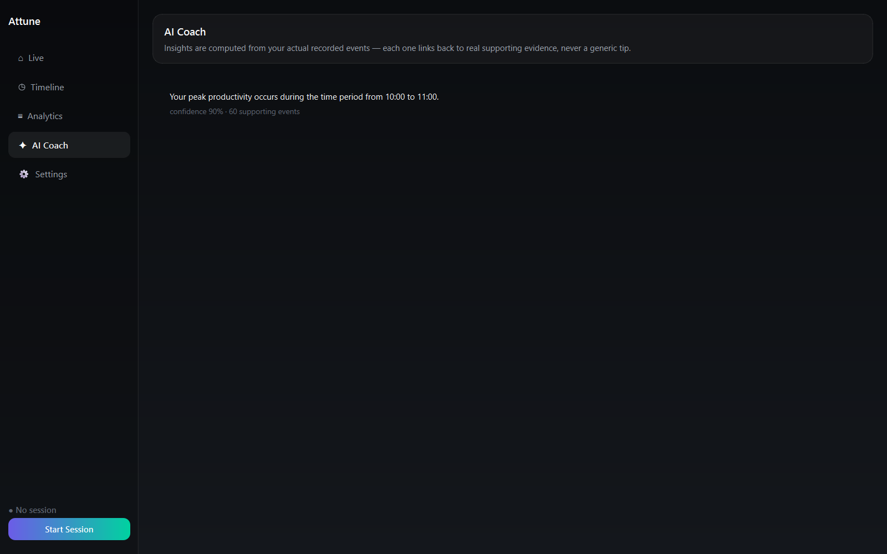
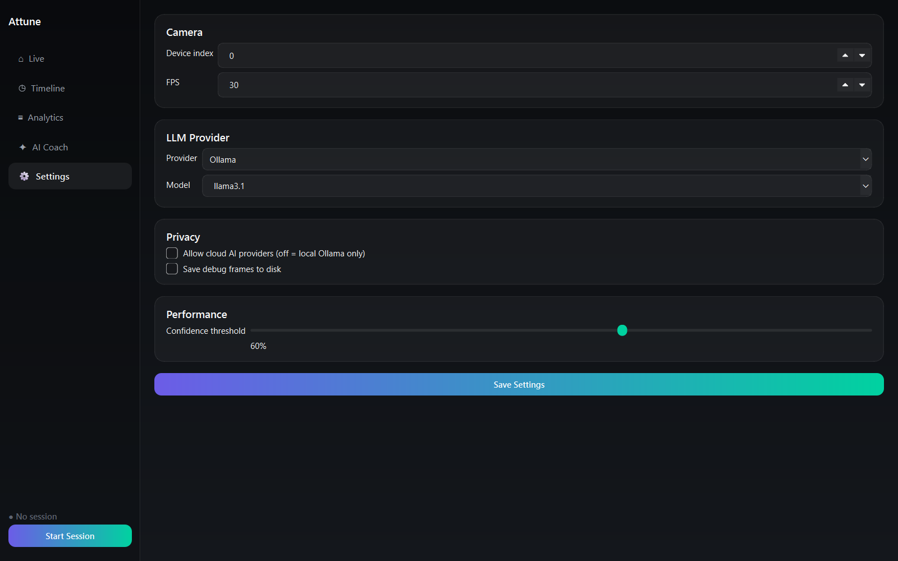

# Attune

**Learn your habits. Improve your focus.**

[](https://github.com/Dhruva-png/Attune/actions/workflows/ci.yml)
[](LICENSE)
[](pyproject.toml)

Attune is a privacy-first desktop productivity coach that understands how you work using *only*
your laptop's built-in webcam — no screen recording, no keyboard logging, no browser extensions,
no wearables. Everything is inferred on-device through computer vision and behavioural analysis;
cloud AI is entirely opt-in, and even then only ever sees text summaries, never your video.

<p align="center">
  
</p>

## What it does

While you work, Attune's webcam pipeline (MediaPipe + YOLO, running entirely on-device) turns
raw frames into a stream of behavioural events, which get rolled up into a live productivity
picture:

- **Focus score** — a continuous 0–100 score from gaze direction, posture, phone activity, and
  presence
- **Fatigue tracking** — yawns, long blinks, face-touching, and an overall Fresh → Very Tired level
- **Posture monitoring** — neck angle and forward lean, with slump detection over time
- **Phone interruptions** — pickup/put-down detection classified as a glance, short check, or
  extended use
- **Break tracking** — away-from-desk detection with count/duration stats
- **AI Coach** — evidence-backed insights ("you lose focus within 5 minutes of checking your
  phone, in 8 of 10 tracked pickups") — every insight carries a computed confidence score and
  links back to the actual events it's based on; nothing is ever asserted by the LLM alone
- **Reports & exports** — daily/weekly/monthly analytics, JSON/CSV data export, and branded PDF
  reports with charts
- **Demo mode** — a synthetic session generator populates a realistic week of data with no
  webcam needed, for trying the app or generating screenshots

## Screenshots

| Live | Timeline |
|---|---|
|  |  |

| AI Coach | Settings |
|---|---|
|  |  |

## Privacy, by construction

- Raw camera frames only ever exist in memory and are never written to disk (unless you
  explicitly turn on debug frame-saving). Only derived signals — landmarks, scores, event
  labels — are persisted.
- The API binds to `127.0.0.1` only; nothing is reachable off your machine.
- The default LLM provider is [Ollama](https://ollama.com), running fully locally. Cloud
  providers (OpenAI, Gemini, Claude, Groq) are opt-in and receive text summaries only — never
  images or video.
- Every AI Coach insight and behavioural conclusion carries a computed confidence score; nothing
  below your configured threshold is surfaced.

See [docs/architecture/01-overview.md §6](docs/architecture/01-overview.md#6-privacy-boundary)
for the full privacy boundary.

## Quick start

Requires Python 3.12+ and a webcam (skip the webcam and use demo mode instead — see below).

```bash
git clone https://github.com/Dhruva-png/Attune.git
cd Attune
pip install -e .
cp .env.example .env
attune
```

`attune` launches the full desktop app — it starts the local API in-process and opens the
dashboard. To run just the backend (e.g. to hit the API directly, see `/docs` for the OpenAPI
UI):

```bash
attune-api
```

> **Windows:** `pip install -e .` can fail with `WinError 206: filename too long` while
> installing PyTorch (an `ultralytics` dependency) unless
> [long path support is enabled](https://learn.microsoft.com/windows/win32/fileio/maximum-file-path-limitation#enable-long-paths-in-windows-10-version-1607-and-later).
> Workaround without changing system settings: install a CPU-only build first —
> `pip install torch==2.9.1 torchvision==0.24.1 --index-url https://download.pytorch.org/whl/cpu`
> — then run the install command above.

By default Attune uses [Ollama](https://ollama.com) for the AI Coach — install it and pull a
model (`ollama pull llama3.1`) for LLM-phrased insights, or leave it uninstalled and the Coach
still works with plain templated text (confidence and evidence always come from your real data,
never the LLM either way).

### Try it without a webcam (demo mode)

```bash
python scripts/seed_demo_data.py
attune
```

This populates a realistic week of synthetic sessions — varied focus/posture/fatigue/phone
patterns across a few named scenarios — so every view has real-looking data immediately. It's
append-only by default; pass `--reset` to start from a clean database.

## Architecture

Attune follows Clean Architecture with strict dependency inversion: vision, behaviour,
analytics, and presentation modules never import each other directly, only communicating through
a typed, in-process event bus. Layering is enforced in CI via
[import-linter](https://import-linter.readthedocs.io/) contracts, not just convention.

Full design docs live in [`docs/architecture/`](docs/architecture/):

1. [Overview & architectural style](docs/architecture/01-overview.md)
2. [Folder structure](docs/architecture/02-folder-structure.md)
3. [Module dependency diagram](docs/architecture/03-module-dependencies.md)
4. [Database schema](docs/architecture/04-database-schema.md)
5. [Event schema](docs/architecture/05-event-schema.md)
6. [API specification](docs/architecture/06-api-specification.md)
7. [UI wireframes](docs/architecture/07-ui-wireframes.md)
8. [Development roadmap](docs/architecture/08-roadmap.md) — the milestone-by-milestone history of
   how this was built

## Tech stack

Python 3.12 · FastAPI · Pydantic · SQLAlchemy/SQLite · OpenCV · MediaPipe · Ultralytics YOLO ·
ONNX Runtime · PySide6 + qasync · Plotly + reportlab · pluggable LLM providers (OpenAI, Gemini,
Claude, Groq, Ollama).

## Development

```bash
pip install -e ".[dev]"
cp .env.example .env
pytest
```

The fast default `pytest` run covers unit tests only (with coverage). Vision-model tests that
need real model weights (downloaded on first use into gitignored `data/models/`), API/database
integration tests, and performance-budget tests are marked `integration` / `performance` and run
separately:

```bash
pytest -m "performance or integration" --no-cov
```

Before opening a PR, run the same checks CI runs:

```bash
ruff check attune tests
mypy attune
lint-imports
pytest
pytest -m "performance or integration" --no-cov
```

See [CONTRIBUTING.md](CONTRIBUTING.md) for the full contributor guide.

## Project status

All 14 planned milestones are complete — see the
[roadmap](docs/architecture/08-roadmap.md) for what shipped in each one, from the core event bus
through the vision pipeline, behaviour engines, database, analytics, API, AI Coach, desktop
dashboard, exports, demo mode, and test/performance hardening.

## License

[MIT](LICENSE)
