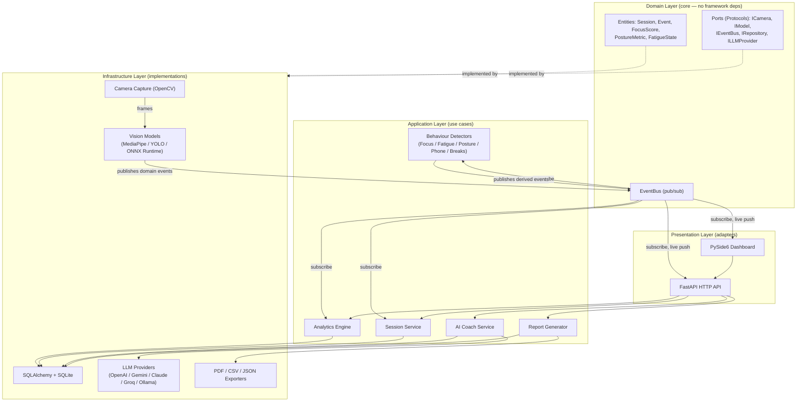

# Attune — Software Architecture Overview

> Milestone 0 deliverable. Defines the architectural rules every later milestone must follow.

## 1. Architectural style

Attune follows **Clean Architecture** with strict dependency inversion, organized around an
**in-process event bus** so vision, behaviour, analytics, and presentation modules never import
each other directly.

## 2. Dependency rule

- **Domain (`core/`)** has zero dependencies on FastAPI, PySide6, OpenCV, MediaPipe, SQLAlchemy,
  or any LLM SDK. It defines entities, value objects, and `typing.Protocol` ports.
- **Application (`behaviour/`, `analytics/`, `llm/coach.py`, session orchestration)** depends only
  on `core`. It implements use cases against the ports, never against concrete infrastructure
  classes.
- **Infrastructure (`vision/`, `database/`, `llm/providers/`, `reports/`)** implements the domain
  ports. It may depend on third-party SDKs freely.
- **Presentation (`api/`, `dashboard/`)** depends on Application use cases only — never reaches
  into Infrastructure directly (e.g. the dashboard never imports OpenCV; it calls a use case or
  hits the local API).

Dependencies point inward only. A composition root (`attune/bootstrap.py`) wires concrete
Infrastructure implementations into Application services at startup via constructor injection —
this is the **only** file allowed to import from every layer.

## 3. Why an event bus (not direct calls)

The spec requires "every module communicates through events" and "modules should never directly
depend on each other." A lightweight async **pub/sub EventBus** (`core/events/bus.py`) is the
mediator:

- Vision/behaviour modules **publish** typed `Event` objects (see
  [05-event-schema.md](05-event-schema.md)).
- Analytics, database logging, the dashboard, and the API's live-stats stream all **subscribe**
  independently.
- New subscribers (e.g. a future Slack notifier) can be added with zero changes to publishers.
- Modules are unit-testable in isolation: feed a detector frames, assert it publishes the
  expected events — no need to spin up the whole pipeline.

## 4. Replaceability (per spec: "every component should be replaceable")

| Port | Interface | Swappable implementations |
|---|---|---|
| `ICamera` | `core/interfaces/camera.py` | `OpenCVCamera`, `MockCamera` (tests), future `MultiCameraSource` |
| `IPoseModel`, `IFaceModel`, `IHandModel`, `IObjectModel` | `core/interfaces/models.py` | MediaPipe today, ONNX/YOLO variants, future Apple Vision Pro backend |
| `IEventRepository`, `ISessionRepository` | `core/interfaces/repository.py` | SQLAlchemy/SQLite today, Postgres/Supabase later |
| `ILLMProvider` | `core/interfaces/llm.py` | OpenAI, Gemini, Claude, Groq, Ollama |
| `IEventBus` | `core/interfaces/bus.py` | In-process asyncio bus today, Redis pub/sub if multi-process is ever needed |

All are `typing.Protocol` classes (structural typing) resolved via a small DI container
(`attune/container.py`), configured from `config/settings.py` (env-var driven, per spec's "never
hardcode APIs").

## 5. Concurrency model

- Camera capture runs on a dedicated thread (OpenCV `VideoCapture.read()` is blocking); frames are
  pushed into a bounded `asyncio.Queue` via `loop.call_soon_threadsafe`.
- Inference (MediaPipe/YOLO/ONNX) runs in a `ThreadPoolExecutor` (CPU-bound, releases the GIL for
  most OpenCV/NumPy calls) at a target 5–10 FPS, decoupled from the 30 FPS UI render loop.
- The EventBus, analytics, database writes, and FastAPI are all `asyncio` native.
- PySide6 runs its own Qt event loop on the main thread; it talks to the async backend through
  `qasync` (integrates Qt's loop with asyncio) so the UI never blocks on inference.
- Graceful degradation: if inference falls behind, frames are dropped (never queued unbounded);
  the UI always shows the latest camera frame even if analysis lags.

## 6. Privacy boundary

- Raw frames exist only in memory (bounded ring buffer), never written to disk unless
  `settings.debug_mode.save_frames = true` (explicit opt-in, off by default).
- Only derived signals (landmarks, scores, events) are persisted to SQLite.
- Cloud LLM providers receive **aggregated text summaries** (event descriptions, scores) —
  never images or raw video — and only when the user explicitly configures a cloud provider
  instead of local (Ollama).

## 7. Related documents

1. [Folder structure](02-folder-structure.md)
2. [Module dependency diagram](03-module-dependencies.md)
3. [Database schema](04-database-schema.md)
4. [Event schema](05-event-schema.md)
5. [API specification](06-api-specification.md)
6. [UI wireframes](07-ui-wireframes.md)
7. [Development roadmap](08-roadmap.md)
