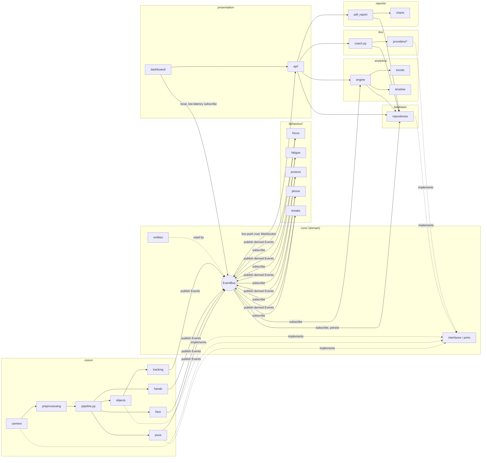

# Module Dependency Diagram

## Rule

Arrows below mean "depends on" / "publishes to". Notice that **no vision, behaviour, or
analytics module ever imports another sibling module directly** — everything routes through
`core.events.EventBus` or `core.interfaces` ports. The only place that knows about every concrete
module is the composition root (`bootstrap.py`).

## Explicit non-dependencies (enforced by import-linter / lint rule in CI)

- `vision/*` must **not** import from `behaviour/*`, `analytics/*`, `database/*`, `llm/*`,
  `api/*`, or `dashboard/*`.
- `behaviour/*` must **not** import from `vision/*` internals (only `core.events.Event` types),
  nor from `analytics/*`, `api/*`, `dashboard/*`.
- `analytics/*` must **not** import from `vision/*` or `behaviour/*` internals — only consumes
  `Event` objects and `database` repositories.
- `dashboard/*` must **not** import `vision/*`, `database/*`, or `llm/*` directly — it goes
  through `api/*` (HTTP/WebSocket) or a thin local-mode facade for camera preview only.
- `core/*` must **not** import anything outside the standard library + `pydantic`.

This is verified in CI with [`import-linter`](https://pypi.org/project/import-linter/) contracts
defined in `pyproject.toml`, so an accidental cross-module import fails the build rather than
being caught in review.

## Why this shape

- **Testability**: every module in `vision/` and `behaviour/` can be unit-tested by feeding it
  synthetic input and asserting on published events — no database, no Qt, no network.
- **Replaceability**: swapping MediaPipe for a future Apple Vision Pro backend touches only
  `vision/pose`, `vision/face`, `vision/hands` — nothing downstream changes because they all speak
  the same `Event` vocabulary.
- **Parallel development**: the CV pipeline, the analytics engine, the dashboard, and the API can
  be built and tested by different milestones without blocking each other, since they only share
  the `core.events` contract.
