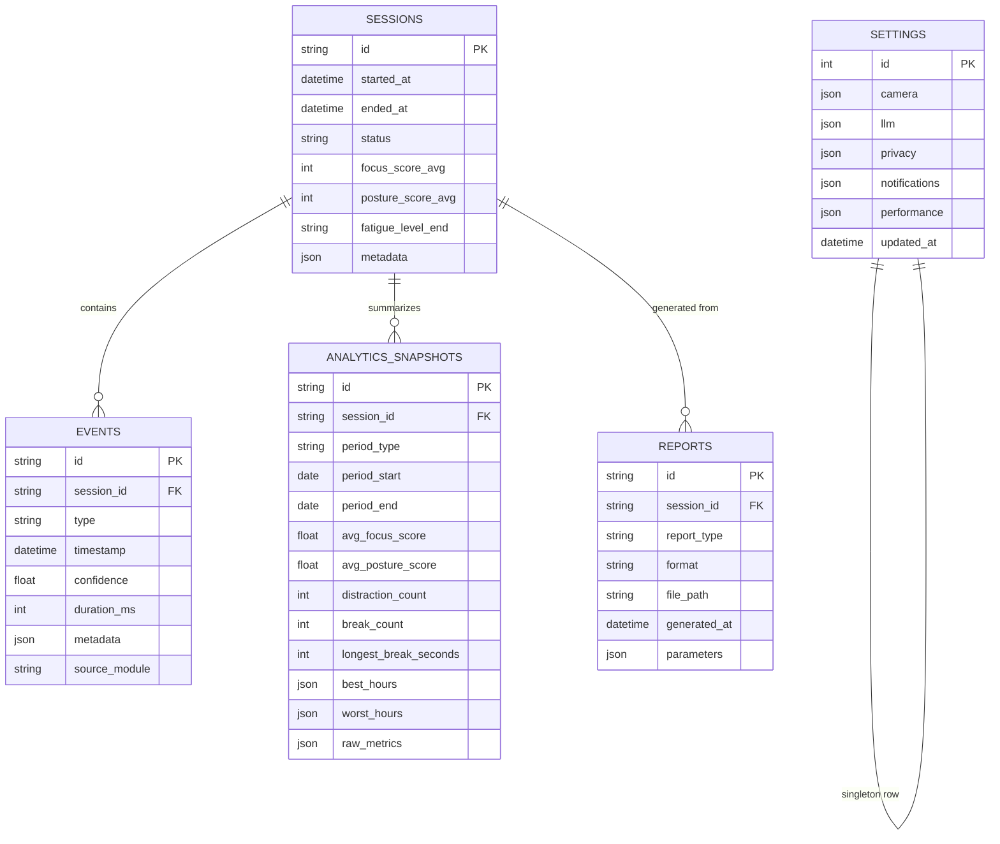

# Database Schema

SQLite via SQLAlchemy (async engine, `aiosqlite` driver). Migrations managed with Alembic.
No raw frames are ever stored in these tables (see privacy boundary in
[01-overview.md](01-overview.md)).

## Entity-relationship overview



## Table definitions (DDL)

```sql
CREATE TABLE sessions (
    id              TEXT PRIMARY KEY,           -- uuid4
    started_at      TIMESTAMP NOT NULL,
    ended_at        TIMESTAMP,
    status          TEXT NOT NULL DEFAULT 'active'
                    CHECK (status IN ('active', 'completed', 'aborted')),
    focus_score_avg REAL,
    posture_score_avg REAL,
    fatigue_level_end TEXT
                    CHECK (fatigue_level_end IN ('fresh', 'normal', 'tired', 'very_tired')),
    metadata        JSON NOT NULL DEFAULT '{}',
    created_at      TIMESTAMP NOT NULL DEFAULT CURRENT_TIMESTAMP
);

CREATE TABLE events (
    id              TEXT PRIMARY KEY,           -- uuid4
    session_id      TEXT NOT NULL REFERENCES sessions(id) ON DELETE CASCADE,
    type            TEXT NOT NULL,               -- see 05-event-schema.md EventType enum
    timestamp       TIMESTAMP NOT NULL,
    confidence      REAL NOT NULL CHECK (confidence >= 0 AND confidence <= 1),
    duration_ms     INTEGER,
    metadata        JSON NOT NULL DEFAULT '{}',
    source_module   TEXT NOT NULL,
    created_at      TIMESTAMP NOT NULL DEFAULT CURRENT_TIMESTAMP
);
CREATE INDEX idx_events_session_id ON events(session_id);
CREATE INDEX idx_events_type ON events(type);
CREATE INDEX idx_events_timestamp ON events(timestamp);

CREATE TABLE analytics_snapshots (
    id                   TEXT PRIMARY KEY,
    session_id           TEXT REFERENCES sessions(id) ON DELETE CASCADE,  -- NULL for rollups spanning sessions
    period_type          TEXT NOT NULL CHECK (period_type IN ('daily', 'weekly', 'monthly')),
    period_start         DATE NOT NULL,
    period_end           DATE NOT NULL,
    avg_focus_score      REAL,
    avg_posture_score    REAL,
    distraction_count    INTEGER NOT NULL DEFAULT 0,
    break_count          INTEGER NOT NULL DEFAULT 0,
    longest_break_seconds INTEGER,
    best_hours           JSON NOT NULL DEFAULT '[]',
    worst_hours          JSON NOT NULL DEFAULT '[]',
    raw_metrics          JSON NOT NULL DEFAULT '{}',
    computed_at          TIMESTAMP NOT NULL DEFAULT CURRENT_TIMESTAMP
);
CREATE UNIQUE INDEX idx_analytics_period ON analytics_snapshots(period_type, period_start, session_id);

CREATE TABLE reports (
    id              TEXT PRIMARY KEY,
    session_id      TEXT REFERENCES sessions(id) ON DELETE CASCADE,
    report_type     TEXT NOT NULL CHECK (report_type IN ('daily', 'weekly', 'monthly', 'session')),
    format          TEXT NOT NULL CHECK (format IN ('pdf', 'csv', 'json', 'png')),
    file_path       TEXT NOT NULL,
    generated_at    TIMESTAMP NOT NULL DEFAULT CURRENT_TIMESTAMP,
    parameters      JSON NOT NULL DEFAULT '{}'
);

CREATE TABLE settings (
    id              INTEGER PRIMARY KEY CHECK (id = 1),  -- singleton row
    camera          JSON NOT NULL DEFAULT '{}',           -- device index, fps, resolution
    llm             JSON NOT NULL DEFAULT '{}',           -- provider, model, api_key_ref (not the key itself)
    privacy         JSON NOT NULL DEFAULT '{}',           -- debug_mode.save_frames, cloud_enabled
    notifications   JSON NOT NULL DEFAULT '{}',
    performance     JSON NOT NULL DEFAULT '{}',           -- inference_fps, confidence_threshold
    theme           TEXT NOT NULL DEFAULT 'dark',
    updated_at      TIMESTAMP NOT NULL DEFAULT CURRENT_TIMESTAMP
);
```

## Design notes

- **`events` is the append-only source of truth.** `analytics_snapshots` are derived/cached
  rollups the Analytics Engine recomputes on a schedule (end of session, nightly for
  daily→weekly→monthly) — they exist purely for fast dashboard/report reads, and can always be
  rebuilt from `events`.
- **JSON columns** (SQLite `JSON1` extension) hold flexible, evolving metadata (e.g. per-event
  landmark summaries, per-snapshot hour-by-hour breakdowns) without schema migrations for every
  new field. Structured/queried fields (type, timestamp, confidence, session_id) stay as real
  columns with indices.
- **`settings` is a single-row table** (simplifies "no user accounts, single local user" reality
  of a desktop app) rather than a key-value table — keeps reads/writes atomic and typed via a
  Pydantic model that (de)serializes the JSON blobs.
- Secrets (LLM API keys) are **never** stored in `settings.llm` JSON — only a provider name and
  model id. Actual keys live in environment variables / OS keychain, read by
  `config/settings.py` at process start (see [LLM provider abstraction](../../README.md)).
- **Cascade deletes**: deleting a session removes its events but reports/snapshots that summarize
  it are kept queryable (nullable `session_id` on cross-session rollups) — exports remain valid
  even if raw session detail is later purged for storage-size settings.
